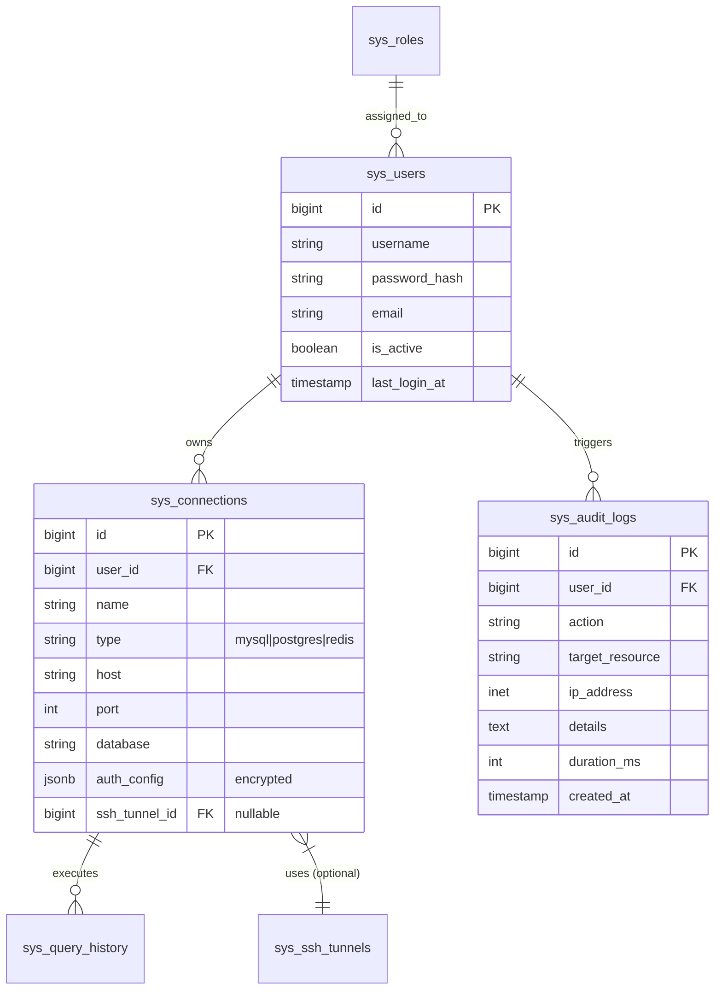

# 数据库设计 (Metadata Schema)

DBHub 的元数据存储采用 PostgreSQL (推荐 v14+)。本设计专注于系统自身的配置管理、用户权限及审计日志，不包含用户连接的目标数据库结构。

## 1. 实体关系图 (ER Diagram)



## 2. DDL 建表脚本

### 2.1 基础配置与扩展

```sql
-- 启用 UUID 扩展（可选）
CREATE EXTENSION IF NOT EXISTS "uuid-ossp";

-- 创建更新时间触发器函数
CREATE OR REPLACE FUNCTION update_updated_at_column()
RETURNS TRIGGER AS $$
BEGIN
    NEW.updated_at = NOW();
    RETURN NEW;
END;
$$ language 'plpgsql';
```

### 2.2 用户与权限 (`sys_users`, `sys_roles`)

```sql
CREATE TABLE sys_roles (
    id SERIAL PRIMARY KEY,
    code VARCHAR(50) NOT NULL UNIQUE, -- admin, developer, readonly
    name VARCHAR(100) NOT NULL,
    description TEXT,
    created_at TIMESTAMPTZ DEFAULT NOW()
);

CREATE TABLE sys_users (
    id BIGSERIAL PRIMARY KEY,
    username VARCHAR(64) NOT NULL UNIQUE,
    password_hash VARCHAR(255) NOT NULL,
    email VARCHAR(255),
    role_id INT REFERENCES sys_roles(id),
    is_active BOOLEAN DEFAULT TRUE,
    last_login_at TIMESTAMPTZ,
    created_at TIMESTAMPTZ DEFAULT NOW(),
    updated_at TIMESTAMPTZ DEFAULT NOW()
);

CREATE TRIGGER update_sys_users_modtime 
    BEFORE UPDATE ON sys_users 
    FOR EACH ROW EXECUTE PROCEDURE update_updated_at_column();
```

### 2.3 SSH 隧道配置 (`sys_ssh_tunnels`)

用于访问位于私有网络中的数据库。

```sql
CREATE TABLE sys_ssh_tunnels (
    id BIGSERIAL PRIMARY KEY,
    user_id BIGINT REFERENCES sys_users(id) ON DELETE CASCADE,
    name VARCHAR(100) NOT NULL,
    host VARCHAR(255) NOT NULL,
    port INT DEFAULT 22,
    username VARCHAR(100) NOT NULL,
    auth_type VARCHAR(20) NOT NULL, -- 'password' or 'private_key'
    private_key TEXT, -- 加密存储
    passphrase TEXT,  -- 加密存储
    password TEXT,    -- 加密存储
    created_at TIMESTAMPTZ DEFAULT NOW(),
    updated_at TIMESTAMPTZ DEFAULT NOW()
);
```

### 2.4 数据库连接配置 (`sys_connections`)

```sql
CREATE TABLE sys_connections (
    id BIGSERIAL PRIMARY KEY,
    user_id BIGINT REFERENCES sys_users(id) ON DELETE CASCADE,
    ssh_tunnel_id BIGINT REFERENCES sys_ssh_tunnels(id) ON DELETE SET NULL,
    
    name VARCHAR(100) NOT NULL,
    type VARCHAR(20) NOT NULL CHECK (type IN ('mysql', 'postgres', 'redis', 'mongo')),
    
    -- 连接详情
    host VARCHAR(255) NOT NULL,
    port INT NOT NULL,
    database VARCHAR(100), -- 默认数据库
    username VARCHAR(100),
    password TEXT, -- 加密存储
    
    -- 高级选项
    ssl_mode VARCHAR(20) DEFAULT 'require',
    connection_timeout INT DEFAULT 10,
    
    -- 颜色标记 (UI)
    color_label VARCHAR(20),
    
    created_at TIMESTAMPTZ DEFAULT NOW(),
    updated_at TIMESTAMPTZ DEFAULT NOW()
);

CREATE INDEX idx_conn_user ON sys_connections(user_id);
```

### 2.5 审计与日志 (`sys_audit_logs`)

```sql
CREATE TABLE sys_audit_logs (
    id BIGSERIAL PRIMARY KEY,
    user_id BIGINT REFERENCES sys_users(id) ON DELETE SET NULL,
    connection_id BIGINT REFERENCES sys_connections(id) ON DELETE SET NULL,
    
    trace_id VARCHAR(64), -- 请求追踪 ID
    action VARCHAR(50) NOT NULL, -- e.g., QUERY, CONNECT, DELETE
    resource_type VARCHAR(50),   -- e.g., DATABASE, CONNECTION
    resource_name VARCHAR(255),
    
    ip_address INET,
    user_agent TEXT,
    
    status SMALLINT DEFAULT 1, -- 1: Success, 0: Failed
    error_message TEXT,
    
    duration_ms INT, -- 执行耗时
    params JSONB,    -- 操作参数快照
    
    created_at TIMESTAMPTZ DEFAULT NOW()
) PARTITION BY RANGE (created_at);

-- 按月分区策略示例
CREATE TABLE sys_audit_logs_y2026m01 PARTITION OF sys_audit_logs
    FOR VALUES FROM ('2026-01-01') TO ('2026-02-01');
```

## 3. 安全策略

### 3.1 敏感数据加密
所有涉及密码、私钥的字段（`private_key`, `passphrase`, `password`）**严禁明文存储**。
- **加密算法**: AES-256-GCM
- **密钥管理**: 密钥应通过环境变量 `APP_SECRET_KEY` 注入，不得写入代码或数据库。

### 3.2 连接池管理
后端 Go 服务应维护所有活跃数据库连接的连接池。
- **空闲超时**: 300s
- **最大生命周期**: 3600s
- **最大连接数**: 根据实例规格动态调整
