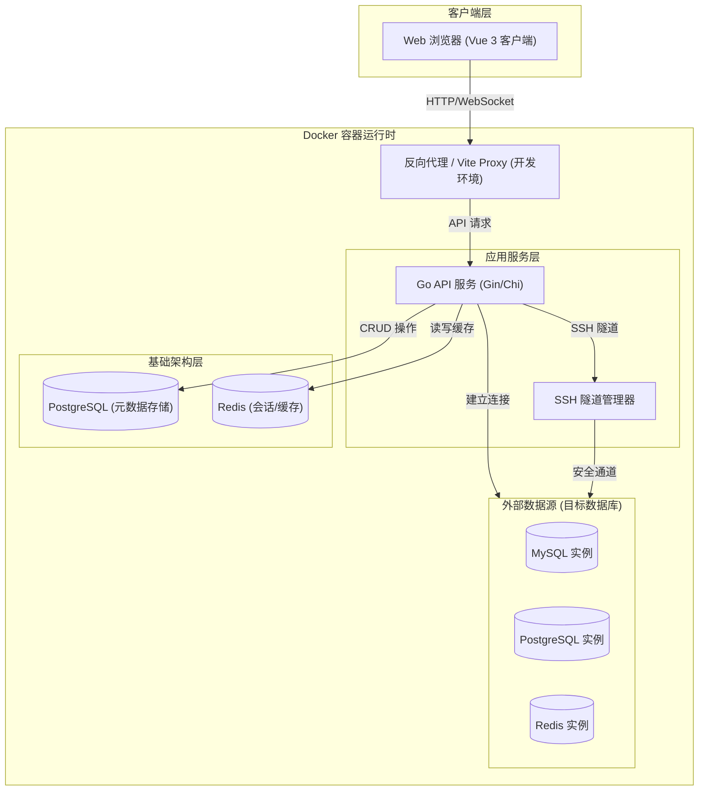

# 系统架构总览 (System Architecture Overview)

DBHub 采用现代化的前后端分离架构，完全基于 Docker 容器化环境构建，旨在提供高性能、高安全性的数据库管理体验。

## 1. 核心架构图

## 2. 核心组件说明

### 2.1 前端 (Frontend)
- **技术栈**: Vue 3 (Composition API), TypeScript, Vite, TailwindCSS v4, Element Plus, ECharts。
- **设计语言**: **Liquid Glass (液态玻璃)** —— 强调通透感、弥散光影与流畅的微交互。
- **职责**:
  - 用户界面渲染与交互。
  - 复杂 SQL 编辑器 (集成 Monaco Editor)。
  - 实时数据可视化图表。
  - 状态管理 (Pinia) 与路由控制。

### 2.2 后端 (Backend)
- **技术栈**: Go (Golang) 1.25+, 标准库 + 轻量级路由组件。
- **职责**:
  - **API 网关**: 统一处理认证、限流、审计。
  - **连接池管理**: 维护到目标数据库的高性能连接池。
  - **SSH 隧道**: 为私有网络数据库提供安全访问通道。
  - **数据脱敏**: 对敏感查询结果进行动态脱敏处理。

### 2.3 基础设施 (Infrastructure)
- **PostgreSQL**: 存储 DBHub 自身的元数据（用户、连接配置、查询历史、审计日志）。
- **Redis**: 用于存储用户 Session、JWT 黑名单以及高频查询缓存。
- **Docker Compose**: 统一编排所有服务，确保开发、测试、生产环境的一致性。

## 3. 关键设计原则

1.  **安全性优先 (Security First)**
    *   **零信任网络**: 假设网络不可信，所有敏感数据（密码、私钥）必须加密存储（AES-256）。
    *   **最小权限**: 数据库连接仅申请执行当前操作所需的最小权限。
    *   **全面审计**: 所有的 SQL 执行、连接操作均被记录，不可篡改。

2.  **高性能 (Performance)**
    *   **并发模型**: 利用 Go 的 Goroutine 处理高并发数据库连接。
    *   **流式处理**: 对于大结果集查询，采用流式 API 返回，避免内存溢出 (OOM)。
    *   **连接复用**: 智能复用数据库连接，减少握手开销。

3.  **用户体验 (UX)**
    *   **极致视觉**: 像素级的液态玻璃 UI 打磨。
    *   **即时反馈**: 所有长时间操作均提供进度条或 WebSocket 实时通知。
    *   **智能辅助**: 提供基于上下文的 SQL 智能补全和错误提示。
