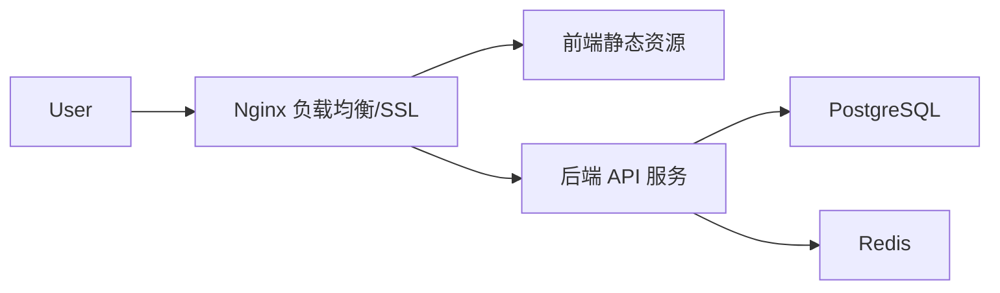

# 部署运维指南 (Deployment)

本文档介绍如何将 DBHub 部署到生产环境。

## 1. 部署架构

在生产环境中，我们推荐通过 Docker Compose 或 Kubernetes 进行部署。



## 2. Docker Compose 部署 (推荐)

我们提供专门的生产环境编排文件 `docker-compose.prod.yaml` (需自行创建)。

### 2.1 准备工作
确保服务器已安装 Docker 和 Docker Compose。

### 2.2 配置文件
创建 `docker-compose.prod.yaml`：

```yaml
version: '3.8'

services:
  frontend:
    image: my-registry/dbhub-frontend:latest
    restart: always
    ports:
      - "80:80"

  backend:
    image: my-registry/dbhub-backend:latest
    restart: always
    environment:
      - APP_ENV=production
      - DB_HOST=postgres
      - REDIS_HOST=redis
    ports:
      - "8080:8080"
    depends_on:
      - postgres
      - redis

  postgres:
    image: postgres:14-alpine
    volumes:
      - pg_data:/var/lib/postgresql/data
    environment:
      POSTGRES_PASSWORD: ${DB_PASSWORD}

  redis:
    image: redis:7-alpine
    volumes:
      - redis_data:/data

volumes:
  pg_data:
  redis_data:
```

### 2.3 构建镜像
在本地或 CI/CD 流水中构建并推送镜像：

```bash
# 构建前端 (生产模式)
docker build -t my-registry/dbhub-frontend:latest -f frontend/Dockerfile .

# 构建后端
docker build -t my-registry/dbhub-backend:latest -f backend/Dockerfile .
```

### 2.4 启动服务

```bash
export DB_PASSWORD=your_secure_password
docker compose -f docker-compose.prod.yaml up -d
```

## 3. 运维监控

### 3.1 日志查看
```bash
docker compose logs -f --tail=100
```

### 3.2 备份策略
- **数据库备份**: 建议每天定时备份 PostgreSQL 数据。
    ```bash
    docker exec -t dbhub-postgres pg_dumpall -c -U postgres > dump_$(date +%Y-%m-%d).sql
    ```

### 3.3 升级流程
1. `docker compose pull` 拉取新镜像。
2. `docker compose up -d` 重启容器。
